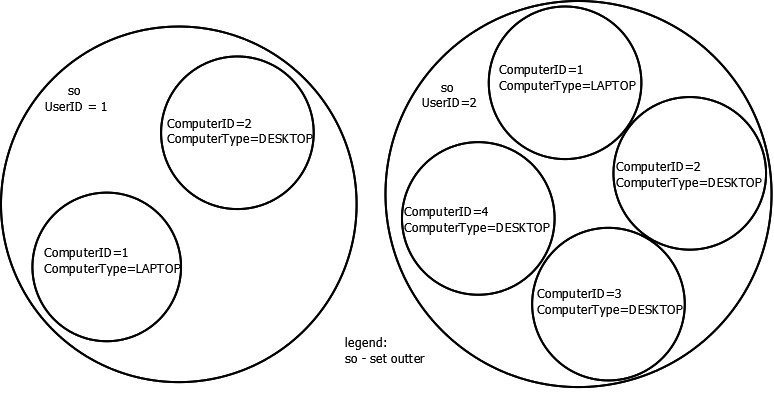
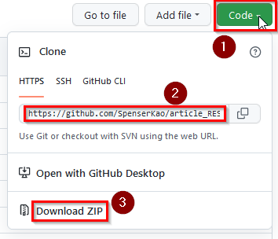

# Calculating Software Application's Copies
## Abstract
As a deliverable to a Coding Test, which is to calculate the total copy of application software. Please refer to original   for more elaborate requirements. The software is implemented in ubiquitous language Golang of version 1.17.1 (go1.17.1 windows/amd64).

## Design
### Set Theory
Following set diagram illustrates philosophy behind the design. In scanning input CSV file, only records associated with specified ApplicationID will be retrieved for calculation.
 
Among the retrieved records, there will be further categorisation by UserID. The remainder of criteria of calculation are ComputerID and ComputerType.

### Approach of Reading Records - All into memory or one at a time
Initially I have tried reading records were read all at once to memory before being parsed for calculation. In the case of processing a relatively large CSV file (sizes 0.99Gb) file I received, according to Task Manager of my Win7 laptop machine, the app eats up nearly 1.2GB of memory, reaching upper limit of the laptop’s memory. In light of even bigger CSV files, the memory resources could become an issue.  
As a matter of fact, it’s a trade-off between resources (memory) and performance. Provided memory is unlimited, then loading all records once into memory before parsing and calculation could be ideal. But memory is not unlimited.  
Hence the adjustment is that up to pre-configured number, which is currently is currently 50, of records are loaded into buffered channel at a time. The buffered channel serves the communication between the process of loading CSV file and main program. With such change, tests indicate that the memory consumption stops peaking to its maximum.

### Added Unit test, Especially on Checking Emptiness of Four of Five Fields
A test file named *__calculator_test.go__* has been created to cover unit test of function ValidRec.

### Added Option to display loaded CVS records
This is an option to display loaded CVS records on screen. The option is *__–i__*.

### Added Logging to File
This is an option to log loaded CSV records and summary info into log file. The option is *__–l__*.

### Added option to show version info
Option *__–v__* is to retrieve version info of underlying release.

### Naming executable
The name of application has been determined as *__calculator__*.

## Software Structure
### src/application
As shown in the diagram above, we need apply the concept of set, not map, to categorise retrieved records. A package named *__application__* has been created under *__src/applcaition__* that implements the concept of set, which is not available from inherent Golang packages.

### image
Contains draphic image.

### requirements
COntains original requirements document named *__requirements.pdf__*

## Setup for Execution
### Cloning Code or Download Zip file
Before building executable code, download zip or clone code by clicking *__Code__* at the middle right of Github screen and associated buttons as shown in the screen shot below.  
 

### Build
Once placing code into desiganted working directory by either cloning it through URL or extracting from downloaded zip file, as stated above, execute following command to build executable code. 
*__go build calculator.go__*

## Command Syntax
Issue following command to get better idea of the command syntax - in the case of Win7 environment 
*__./calculator.exe –help__*
<pre>
  -a string
        application ID (default "374")
        “374” is the default ApplicationID for loading CSV records, it can be altered by option –a.
  -i string
        name of sample input file (default "small-sample.csv")
        Input CSV file is default to small-sample.csv, and can be altered by option –i.
  -l by default, no log. (default: false)
        Log file, if option is specified, the log filename will be formed in following convention:
        For the sake of traceability, the calculation output, including summary info, can be collected into log file through option –l. If created, 
        the log’s filename is the following convention: log<YYYY>-<Month>-<Day>_<hh>-<mm>-<ss>.txt, where the datetime code is referring to UTC time.
  -s by default, after the calculation,
        only total number of valid records and
        total number of applications required will be shown,
        should also show the records' info on screen? (default: false)
  -v version info
</pre>
